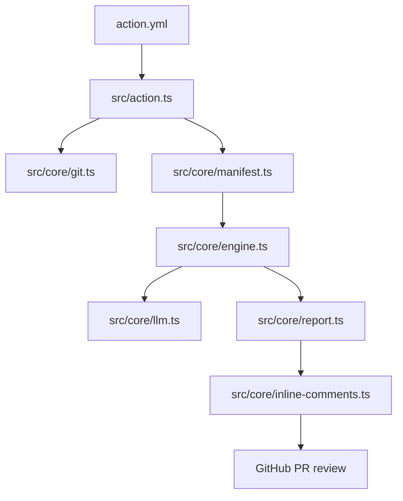

# CCR Repo Map

Short. Caveman mode. No fluff.

## 1. What repo is

- GitHub Action for PR review.
- Input: PR diff + repo context.
- Output: review JSON, summary, optional inline PR comments.
- Main path: `action.yml` -> `dist/index.cjs` -> `src/action.ts`.

## 2. Top files

- `action.yml`: action inputs, outputs, runner, entry file.
- `package.json`: build, test, lint, typecheck scripts.
- `README.md`: quick start and prompt notes.
- `example-workflow.yml`: sample GitHub Actions use.
- `scripts/build-action.mjs`: bundle TS to `dist/index.cjs`.
- `scripts/ccr_reviewer.py`: Python mirror / helper with same prompt idea.
- `tests/`: TS and Python tests.
- `prompts/`: all review text.

## 3. Main runtime path

- `src/action.ts`: read inputs, collect diff, load architecture, run review, write outputs, post inline comments.
- `src/core/git.ts`: get changed files, commit messages, PR range.
- `src/core/manifest.ts`: load `manifest.json`, prompt text, persona text, prompt overrides.
- `src/core/engine.ts`: build prompt layers, run single / sequential / parallel flow.
- `src/core/llm.ts` + `src/core/api.ts`: talk to ASU AIML API.
- `src/core/report.ts`: parse model JSON, build markdown report.
- `src/core/inline-comments.ts` + `src/core/patch-map.ts`: map findings to changed lines.
- `src/core/github-review.ts`: send review comments to GitHub.
- `src/core/logging.ts`: logs.
- `src/core/types.ts`: shared shapes.

## 4. Prompt stack

Every call in `src/core/engine.ts` uses same stack:

1. Identity: hardcoded `You are a code reviewer.`
2. Persona: shared persona or stage persona.
3. Instructions: stage prompt file.
4. Humanize: shared writing rules.
5. User message: diff envelope + output-format contract.

`shared/output-format.md` is part of user message. Not its own system layer.

## 5. Architectures

### Single-pass

- 1 stage.
- 1 model call.
- Flow: one shot -> parse JSON -> report.
- Files: `prompts/architectures/single-pass/manifest.json`, `prompts/architectures/single-pass/prompt.md`, `prompts/shared/persona.md`, `prompts/shared/humanize.md`, `prompts/shared/output-format.md`.
- Total: 4 md files + 1 json manifest.
- Good for small PRs.

### Iterative

- 6 stage calls + 1 combine call.
- Flow: stage 1 -> 2 -> 3 -> 4 -> 5 -> 6 -> combine.
- Each stage sees past outputs.
- Combine sees all 6 outputs.
- Files:
  - `prompts/architectures/iterative/manifest.json`
  - `prompts/architectures/iterative/combine.md`
  - `prompts/architectures/iterative/combine-persona.md`
  - `prompts/shared/stages/stage-1.md` ... `stage-6.md`
  - `prompts/shared/stages/stage-1-persona.md` ... `stage-6-persona.md`
  - `prompts/shared/persona.md`
  - `prompts/shared/humanize.md`
  - `prompts/shared/output-format.md`
- Total: 17 md files + 1 json manifest.
- Good when later stage should refine earlier stage.

### Parallel

- 6 stage calls + 1 combine call.
- Flow: stage 1..6 at same time -> combine.
- Stage calls do not see each other.
- Files:
  - `prompts/architectures/parallel/manifest.json`
  - `prompts/architectures/parallel/combine.md`
  - `prompts/architectures/iterative/combine-persona.md`
  - same `prompts/shared/stages/*` files
  - same shared persona, humanize, output-format
- Total: 17 md files + 1 json manifest.
- Good for max coverage.

## 6. What each prompt file does

- `prompts/shared/persona.md`: base voice.
- `prompts/shared/humanize.md`: tone, length, anti-repeat.
- `prompts/shared/output-format.md`: JSON shape and field rules.
- `prompts/shared/stages/stage-N.md`: what stage looks for.
- `prompts/shared/stages/stage-N-persona.md`: stage voice.
- `prompts/architectures/single-pass/prompt.md`: all-criteria one-shot review.
- `prompts/architectures/iterative/combine.md` and `prompts/architectures/parallel/combine.md`: merge and dedupe stage output.
- `prompts/architectures/iterative/combine-persona.md`: combine voice for both multi-stage modes.
- `manifest.json`: wires mode, stage order, and combine stage.

## 7. What not to change

Break risk:

- `src/core/engine.ts`
- `src/core/manifest.ts`
- `src/core/prompt-loader.ts`
- `src/core/report.ts`
- `src/core/inline-comments.ts`
- `src/core/patch-map.ts`
- `prompts/shared/output-format.md`
- `prompts/architectures/*/manifest.json`

Why:

- engine builds prompt stack and stage flow.
- manifest ties files to modes.
- prompt-loader finds prompt root.
- report parses model JSON.
- inline-comments + patch-map map findings to changed lines.
- output-format and manifests can break parse or structure.

## 8. What changes response

- Tone only: `prompts/shared/persona.md`, stage persona files, `prompts/shared/humanize.md`, `prompts/architectures/iterative/combine-persona.md`.
- Review focus: `prompts/shared/stages/stage-*.md`, `prompts/architectures/single-pass/prompt.md`, combine `.md` files.
- Final JSON shape: `prompts/shared/output-format.md`.
- Inline comment behavior: `src/core/inline-comments.ts`, `src/core/patch-map.ts`.
- GitHub UI comments: `src/core/github-review.ts`; JSON only feeds the comment builder.

## 9. High-level flow

## 10. Short rules

- Change persona for voice.
- Change stage prompt for findings.
- Change humanize for length.
- Change manifest only to rewire stages.
- Do not touch output-format unless parser and tests also change.
