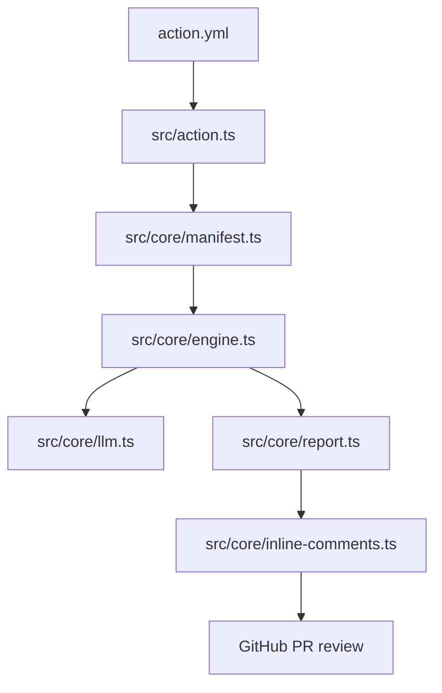

# Single-Pass Map

Short. Caveman mode. Single-pass only.

## 1. What it is

- One review stage.
- One model call.
- One final JSON report.
- Best for small PRs.

## 2. Main path

- `action.yml` -> `dist/index.cjs` -> `src/action.ts`.
- `src/action.ts` loads architecture, gets diff, runs review, posts outputs.
- `src/core/engine.ts` builds prompt stack and runs single-pass flow.
- `src/core/manifest.ts` loads single-pass manifest and prompt text.
- `src/core/report.ts` parses JSON and builds markdown report.
- `src/core/inline-comments.ts` + `src/core/patch-map.ts` map findings to changed lines.

## 3. Prompt stack

Every call uses same stack:

1. Identity: hardcoded `You are a code reviewer.`
2. Persona: `prompts/shared/persona.md`
3. Instructions: `prompts/architectures/single-pass/prompt.md`
4. Humanize: `prompts/shared/humanize.md`
5. User message: diff envelope + `prompts/shared/output-format.md`

`output-format.md` is part of user message. Not separate system layer.

## 4. Single-pass files

- `prompts/architectures/single-pass/manifest.json`: wires single mode.
- `prompts/architectures/single-pass/prompt.md`: full audit rules.
- `prompts/shared/persona.md`: base reviewer voice.
- `prompts/shared/humanize.md`: tone, length, anti-repeat.
- `prompts/shared/output-format.md`: JSON shape and field rules.

Total: 4 md files + 1 manifest.

## 5. Flow

## 6. What not to change

Break risk:

- `src/core/engine.ts`
- `src/core/manifest.ts`
- `src/core/prompt-loader.ts`
- `src/core/report.ts`
- `src/core/inline-comments.ts`
- `src/core/patch-map.ts`
- `prompts/shared/output-format.md`
- `prompts/architectures/single-pass/manifest.json`

Why:

- engine builds prompt stack.
- manifest ties single-pass files together.
- prompt-loader finds prompt root.
- report parses model JSON.
- inline-comments + patch-map map findings to lines.
- output-format and manifest can break structure.

## 7. What changes response

- Tone only: `prompts/shared/persona.md`, `prompts/shared/humanize.md`.
- Review focus: `prompts/architectures/single-pass/prompt.md`.
- Final JSON shape: `prompts/shared/output-format.md`.
- Inline comment style: `src/core/inline-comments.ts`.

## 8. Short rules

- Change persona for voice.
- Change prompt for findings.
- Change humanize for length.
- Do not touch output-format unless parser and tests also change.
