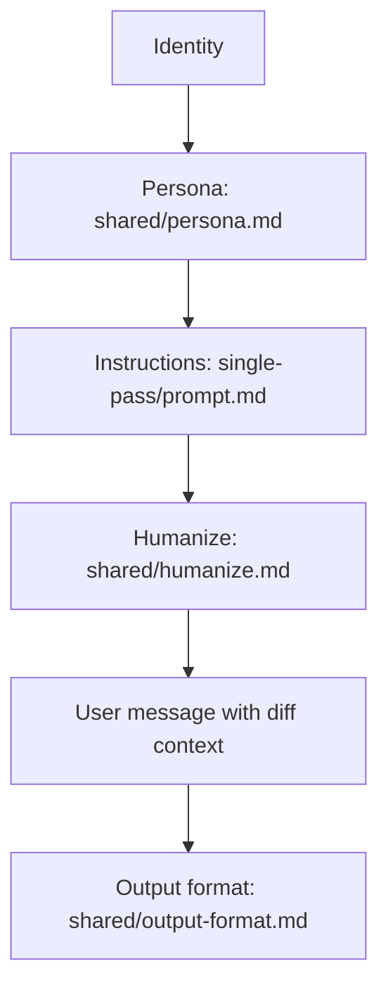

# Presentation Brief: Single-Pass Workflow

Create a slide deck that explains the single-pass prompt architecture in this project. Write the deck like a human teammate would explain it to another person: clear, direct, and visually guided. The story must start with a pull request being generated and end with the review result appearing in GitHub Actions and the related comments being posted back to the PR.

## Audience

- A teammate, reviewer, or new contributor who understands pull requests and GitHub Actions at a basic level.
- Assume they do not know the internal prompt architecture yet.

## Tone

- Friendly, plain language, and confident without sounding formal or robotic.
- Explain each step in a simple order.
- Keep each slide focused on one idea.
- Prefer concrete labels over abstract jargon.

## Visual Theme

Use a nature-inspired theme that fits the project vision of careful review, growth, clarity, and trust.

- Primary colors: forest green, leaf green, sky blue, soft white, and warm earth neutrals.
- Accent colors: muted gold or sunlight beige for highlights.
- Motifs: trees, leaves, sky, horizon lines, soft slopes, and organic shapes.
- Style: clean, airy, modern, and calm. Use lots of white space.
- Mood: thoughtful, transparent, and steady.
- Avoid harsh neon, dark sci-fi styling, dense clutter, or overly playful cartoon art.
- If the deck generator supports it, use subtle gradients or a soft illustrated background instead of a flat solid color.

## Required Story Flow

Tell the story in order:

1. A pull request is generated or updated.
2. GitHub Actions picks up the event and starts the CCR workflow.
3. `src/action.ts` loads the single-pass architecture and collects the diff and review context.
4. `prompts/architectures/single-pass/manifest.json` points to the one review stage.
5. The engine builds the prompt stack.
6. The LLM makes one single-pass review call.
7. The model returns JSON that matches the output format contract.
8. The report is rendered and inline comments are mapped back to changed lines.
9. The workflow posts comments back to the PR and the GitHub Actions run shows the completed review.

## Slide Outline

Use about 8-10 slides. Add an appendix slide only if needed.

- Slide 1: Title slide, "How Single-Pass Review Works"
- Slide 2: Why this workflow exists
- Slide 3: From PR to GitHub Actions
- Slide 4: Single-pass architecture at a glance
- Slide 5: How prompting works
- Slide 6: What each prompt file does
- Slide 7: What happens after the model responds
- Slide 8: How findings become comments
- Slide 9: End state and recap

## Prompt Files To Explain

Make sure the deck clearly explains what each file does and how it affects the workflow.

- `prompts/architectures/single-pass/manifest.json`
  - Declares the single-pass architecture.
  - Tells the engine there is only one stage.
  - Connects the stage to the prompt and persona files.
- `prompts/architectures/single-pass/prompt.md`
  - Contains the full single-pass review instructions.
  - Holds the criteria the model uses to inspect the PR.
- `prompts/shared/persona.md`
  - Sets the reviewer voice and behavior.
  - Keeps the tone human, helpful, and consistent.
- `prompts/shared/humanize.md`
  - Controls writing quality, length, and natural phrasing.
  - Prevents robotic or repetitive wording.
- `prompts/shared/output-format.md`
  - Defines the JSON response shape.
  - Keeps the model output machine-readable so the report and comments can be built reliably.

If it helps the presentation, also mention the supporting runtime files:

- `src/core/manifest.ts`
- `src/core/engine.ts`
- `src/core/report.ts`
- `src/core/inline-comments.ts`
- `src/core/patch-map.ts`
- `src/core/github-review.ts`

## How Prompting Works

Show the prompt stack as a sequence from top to bottom.

- Layer 1: Identity
  - The hardcoded reviewer identity and architecture metadata.
- Layer 2: Persona
  - The shared reviewer voice from `shared/persona.md`.
- Layer 3: Instructions
  - The single-pass review rules from `prompt.md`.
- Layer 4: Humanize
  - The natural-language constraints from `shared/humanize.md`.
- Layer 5: Output format
  - The JSON schema from `shared/output-format.md`, included with the user message.

Explain that the engine uses one combined request, so the model sees the diff, the context, the prompt instructions, and the output contract in a single pass.

## Diagrams To Include

Use diagrams or flowcharts wherever they make the explanation easier to follow.

### Workflow Diagram

Show the full path from PR creation to review comments.

### Prompt Stack Diagram

Show the order the model sees the prompt layers.

### File Map Diagram

If space allows, add a small file map that shows which file controls which part of the review.

## Important Presentation Rules

- Do not overstuff slides with text.
- Prefer one main message per slide.
- Use simple labels that a person can skim quickly.
- When you mention code files, explain them in plain English first.
- Keep the story linear and end with the visible result in GitHub Actions and the PR comments.
- Make the deck feel like a careful walkthrough, not a technical dump.

## Closing Slide

End with a short recap that ties the whole story together:

- One PR triggers one single-pass review.
- One prompt stack produces one JSON result.
- One review run creates the GitHub Actions summary and the posted comments.

That should give the deck a clean beginning, middle, and end.